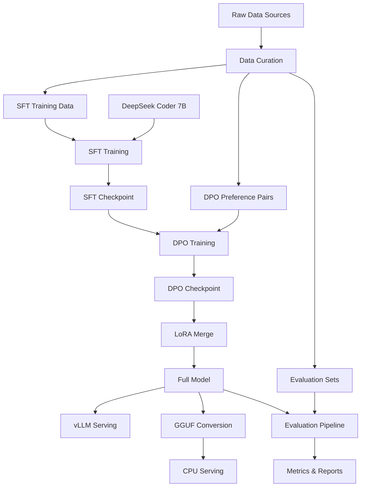

# Aletheia Architecture

## Overview

Aletheia implements a modern LLM training and serving pipeline optimized for domain specialization. The architecture follows a staged approach: data curation → supervised fine-tuning → preference optimization → serving.

## System Architecture



## Training Pipeline

### Phase 1: Supervised Fine-Tuning (SFT)

**Objective**: Teach the model to follow instructions and respond in the target domain.

**Architecture**:
- **Base Model**: DeepSeek Coder 7B Instruct (3B parameters)
- **Method**: LoRA (Low-Rank Adaptation) fine-tuning
- **Quantization**: 8-bit loading for memory efficiency
- **Sequence Length**: 4096 tokens with packing enabled

**LoRA Configuration**:
```yaml
rank: 16              # Low-rank matrices dimension
alpha: 32             # Scaling factor (typically 2x rank)
dropout: 0.05         # Regularization
target_modules:       # Attention and MLP projections
  - q_proj, k_proj, v_proj, o_proj
  - gate_proj, up_proj, down_proj
```

**Training Configuration**:
- **Batch Size**: 2 per device × 16 accumulation = 32 effective batch size
- **Learning Rate**: 2e-4 with cosine scheduling
- **Epochs**: 2 (prevent overfitting on small datasets)
- **Optimizer**: AdamW with weight decay 0.0

### Phase 2: Direct Preference Optimization (DPO)

**Objective**: Improve response quality and alignment through preference learning.

**Architecture**:
- **Input**: SFT checkpoint with LoRA adapters
- **Method**: DPO algorithm (simpler alternative to RLHF)
- **Beta**: 0.1 (controls strength of preference learning)

**Training Configuration**:
- **Batch Size**: 2 per device × 16 accumulation = 32 effective
- **Learning Rate**: 1e-5 (lower than SFT to avoid catastrophic forgetting)
- **Epochs**: 1 (DPO converges quickly)

## Model Architecture Details

### Base Model: DeepSeek Coder 7B

```
Architecture: LLaMA-based transformer
- Layers: 32
- Hidden Size: 4096
- Attention Heads: 32
- Vocabulary: 32,000 tokens
- Context Length: 16,384 tokens (limited to 4,096 in training)
```

### LoRA Adaptation

```
Parameter Efficiency:
- Full model: ~7B parameters
- LoRA adapters: ~16M parameters (0.2% of full model)
- Memory usage: ~50% reduction with 8-bit quantization
```

## Data Pipeline

### Data Format Standards

**SFT Data (JSONL)**:
```json
{
  "prompt": "Technical question about systems engineering",
  "response": "Detailed, accurate technical response with examples"
}
```

**DPO Data (JSONL)**:
```json
{
  "prompt": "Same technical question",
  "chosen": "High-quality response with better structure/accuracy",
  "rejected": "Lower-quality response (generic, incomplete, incorrect)"
}
```

### Data Processing Pipeline

1. **Collection**: Curate domain-specific Q&A pairs
2. **Formatting**: Convert to instruction format with ### markers
3. **Quality Control**: Filter for length, relevance, correctness
4. **Splitting**: 80% train, 10% validation, 10% held-out evaluation

## Serving Architecture

### GPU Serving (vLLM)

```
vLLM Features:
- PagedAttention for memory efficiency
- Continuous batching for throughput
- OpenAI-compatible API
- Tensor parallelism support
```

**Serving Stack**:
```
Client Request
     ↓
OpenAI Proxy (Optional)
     ↓
vLLM API Server
     ↓
Model Inference
     ↓
Response
```

### CPU Serving (llama.cpp)

```
Quantization Options:
- Q4_K_M: 4-bit (recommended for CPU)
- Q5_K_M: 5-bit (better quality)
- Q6_K: 6-bit (high quality)
- Q8_0: 8-bit (near-original quality)
- F16: Half precision (largest)
```

**Performance Characteristics**:
- Q4_K_M: ~50% model size, ~10% quality loss
- Optimized for M-series Mac and x86_64
- Single-threaded inference with multi-core support

## Evaluation Architecture

### Benchmark Evaluation

**lm-eval-harness Integration**:
```bash
Tasks: hellaswag, truthfulqa_mc2, winogrande, gsm8k, mbpp
Metrics: Accuracy, normalized accuracy, perplexity
Output: JSON results with per-task breakdown
```

### Custom Evaluation

**Comparison Framework**:
1. Load base model and tuned model
2. Generate responses for evaluation prompts
3. Compare response quality (length, structure, accuracy)
4. Calculate win rates and improvement metrics

## Monitoring and Observability

### Training Metrics
- Loss curves (training/validation)
- Learning rate scheduling
- Gradient norms and parameter updates
- Memory usage and throughput

### Serving Metrics
- Request latency (p50, p95, p99)
- Throughput (requests/second)
- Resource utilization (GPU/CPU/memory)
- Error rates and timeout tracking

### Model Quality Metrics
- Benchmark scores on standard datasets
- Domain-specific evaluation results
- Response quality assessments
- User feedback and ratings

## Scalability Considerations

### Training Scalability
- **Multi-GPU**: Distributed training with DeepSpeed/FSDP
- **Gradient Accumulation**: Simulate larger batch sizes
- **Memory Optimization**: Gradient checkpointing, mixed precision

### Serving Scalability
- **Horizontal Scaling**: Multiple vLLM instances behind load balancer
- **Vertical Scaling**: Larger GPU instances (A100 → H100)
- **Edge Deployment**: CPU inference for low-latency applications

### Data Scalability
- **Streaming**: Process large datasets without loading into memory
- **Parallel Processing**: Multi-process data preparation
- **Incremental Training**: Add new data without full retraining

## Security Architecture

### Training Security
- **Data Privacy**: Avoid PII in training data
- **Model Safety**: Content filtering and safety evaluation
- **Access Control**: Secure model checkpoints and training logs

### Serving Security
- **API Authentication**: Bearer tokens and rate limiting
- **Input Validation**: Sanitize and validate all inputs
- **Output Filtering**: Block potentially harmful responses

## Deployment Patterns

### Development Environment
```
Local Machine:
- CPU/GPU training for small experiments
- Single-node serving for development
- Minimal resource requirements
```

### Production Environment
```
Cloud Infrastructure:
- Multi-GPU training clusters (A100/H100)
- Load-balanced serving with auto-scaling
- Monitoring and alerting systems
- CI/CD pipeline for model updates
```

## Future Enhancements

### Potential Improvements
1. **RLHF Integration**: Replace DPO with full RLHF pipeline
2. **Multi-Modal Support**: Extend to code + documentation
3. **Function Calling**: Tool use capabilities
4. **Continuous Learning**: Online learning from user feedback
5. **Federated Training**: Distributed training across organizations

### Technical Roadmap
- **v1.0**: Current SFT + DPO pipeline
- **v1.1**: Enhanced evaluation and monitoring
- **v2.0**: RLHF and function calling
- **v3.0**: Multi-modal and continuous learning